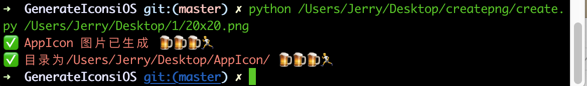

# GenerateIconsiOS
一个一键生成多个icon的库，简单到没朋友。iOS开发者的福星。




### 参数：
```
python ./create.py 图片Path 图片存储路径
```
### 例子：

```
python ./create.py /Users/Jerry/Desktop/demo.png /Users/Jerry/Desktop/dmeo
```

### 想要生成其他的任意大小任意多个怎么办？


只需要在配置`config`文件里边新增即可

```
一倍图文件夹 "ipad"是用到ipad上，可以同时多个'iphone','ipad'
imageSizes = [[20,20,"ipad"],
[29,29,"iphone","ipad"],
[40,40,"ipad"]]
二倍图
imageSizesDouble = [[20,20,"iphone","ipad"],
                    [29,29,"iphone","ipad"],
                    [40,40,"iphone","ipad"],
                    [60,60,"iphone"],
                    [76,76,"ipad"],
                    [83.8,83.5,"ipad"]]
                    
三倍图        
imageSizesThree = [[20,20,"iphone"],
[29,29,"iphone"],
[40,40,"iphone"],
[60,60,"iphone"]]
```


### 最后只需要将文件和json文件复制到iOS工程的assets中即可。


